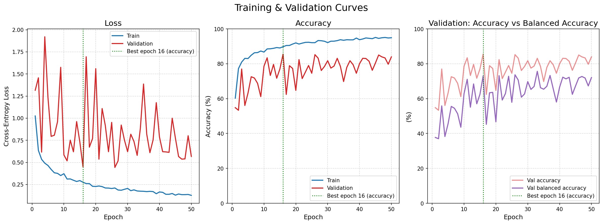
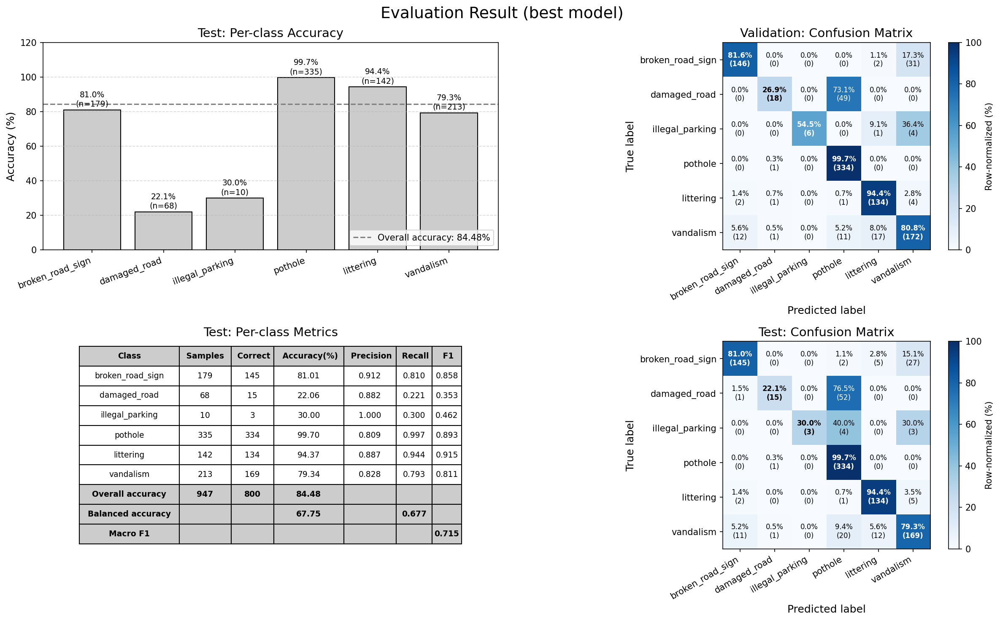
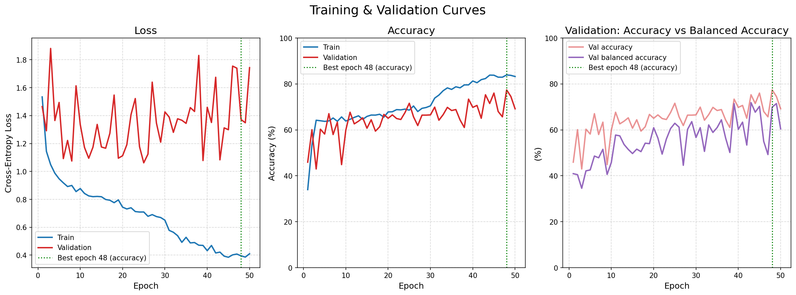
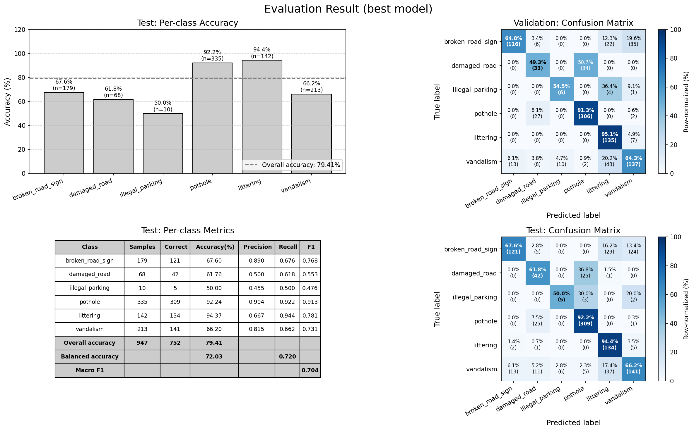
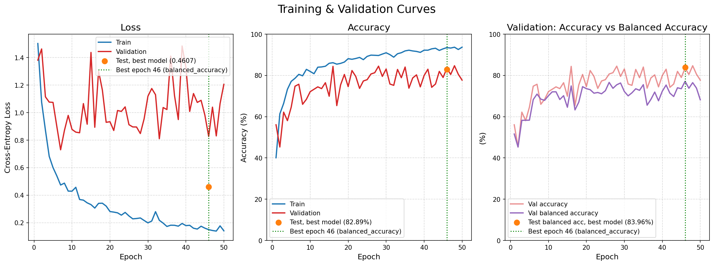
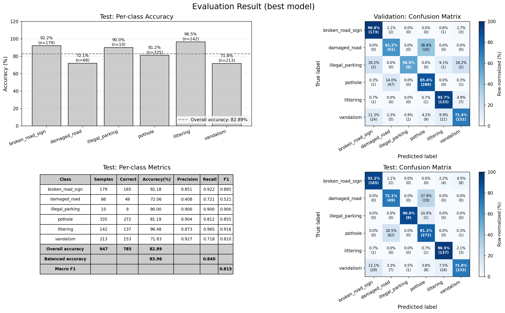

# Road Issues Classification with a Small CNN (PyTorch)

Classifying street-level photos into 6 categories of urban road problems
(potholes, damaged roads, broken signs, illegal parking, littering, vandalism)
with a compact CNN trained from scratch on CPU.

## Motivation

My graduate research was in deep reinforcement learning, so I had little hands-on
experience with computer vision. This project is my from-scratch walkthrough of a
CNN pipeline: data preparation, training loop, evaluation, and error analysis,
with a deliberately small model so it trains in ~30 minutes on an office laptop
(Intel i5-12400, no GPU).

The goal is not the highest accuracy, but the full loop:
train, measure, find out *why* it fails, fix it, measure again.

## Dataset

[Road Issues Detection Dataset](https://www.kaggle.com/datasets/programmerrdai/road-issues-detection-dataset)
(Kaggle, originally from Roboflow). Images are resized to 128x128.
The "Mixed Issues" multi-label category is excluded, leaving 6 classes,
split 80 / 10 / 10 (stratified) into train / val / test.

| Class            | Train | Val | Test |
|------------------|------:|----:|-----:|
| pothole          | 2678  | 335 |  335 |
| vandalism        | 1702  | 213 |  213 |
| broken_road_sign | 1435  | 179 |  179 |
| littering        | 1135  | 142 |  142 |
| damaged_road     |  542  |  67 |   68 |
| illegal_parking  |   83  |  11 |   10 |
| **Total**        | 7575  | 947 |  947 |

The dataset is heavily imbalanced: `pothole` alone is ~35% of the data while
`illegal_parking` is ~1%. This turns out to be the main story of the project.

`prepare_dataset.py` handles a Windows-specific problem: the Kaggle archive has
paths longer than 260 characters, which makes `zipfile` fail. It extracts with the
`\\?\` long-path prefix and re-maps classes to short folder names.

## Model

A 3-block CNN:

```
[Conv3x3(16) -> BatchNorm -> ReLU -> MaxPool2 -> Dropout] x 3
-> Flatten -> FC(4096->16) -> ReLU -> FC(16->16) -> ReLU -> FC(16->6)
```

Dropout is 0.5 / 0.25 / 0.1 for the three blocks. Optimizer AdamW (lr 1e-3),
batch size 32, 50 epochs, cross-entropy loss. The checkpoint with the best validation
score is saved to `outputs/<experiment_name>/best_model.pth` and used for the test set.
The selection metric is switchable in `config.py` (`"accuracy"` or `"balanced_accuracy"`).

In the training-curve figures, the orange dot marks the *test* result of the best
checkpoint, placed at the best epoch (green dotted line). This was added in v3, so the
v1 and v2 figures do not have it; their test numbers are in the tables below.

## Results

### v1 - baseline

| Metric              | Test    |
|---------------------|--------:|
| Accuracy            |  84.48% |
| Balanced accuracy   |  67.75% |
| Macro F1            |   0.715 |
| Best epoch (of 50)  |      16 |

| Class            | Test recall | Main confusion                                   |
|------------------|------------:|--------------------------------------------------|
| pothole          |       99.7% | -                                                |
| littering        |       94.4% | -                                                |
| broken_road_sign |       81.0% | -> vandalism (27)                                |
| vandalism        |       79.3% | -> pothole (20), littering (12), broken_sign (11)|
| illegal_parking  |       30.0% | (only 10 samples)                                |
| damaged_road     |       22.1% | -> pothole (52 of 68)                            |




#### Interpretation

* **Overall accuracy is misleading.** 84.48% is mostly `pothole` and `littering`.
  Balanced accuracy (mean per-class recall) is the fairer number: 67.75%.
* **`damaged_road` collapses into `pothole`** (52 of 68). Both are "defects on the
  road surface", and `pothole` has 5x more samples, so the model defaults to the
  majority class when unsure. The 128x128 input may also hide the surface details
  that separate them.
* **`broken_road_sign` -> `vandalism` and `vandalism` -> `littering`** suggest the
  model is partly learning "street scene with something wrong" rather than the object.
* **Validation accuracy oscillates by 30-40 points between epochs.** With this
  imbalance, a small shift in the decision boundary sends whole minority classes
  into `pothole`.

### v2 - class-weighted loss

Same setup as v1, but the cross-entropy loss is weighted by inverse class frequency
of the training set. Model selection still uses validation accuracy.

| Metric              | v1 baseline | v2 weighted |
|---------------------|------------:|------------:|
| Accuracy            |      84.48% |      79.41% |
| Balanced accuracy   |      67.75% |      72.03% |
| Macro F1            |       0.715 |       0.704 |
| Best epoch (of 50)  |          16 |          48 |

| Class            | Test recall | Main confusion                                    |
|------------------|------------:|---------------------------------------------------|
| littering        |       94.4% | -                                                 |
| pothole          |       92.2% | -> damaged_road (25)                              |
| broken_road_sign |       67.6% | -> littering (29), vandalism (24)                 |
| vandalism        |       66.2% | -> littering (37), broken_sign (13), damaged (11) |
| damaged_road     |       61.8% | -> pothole (25 of 68)                             |
| illegal_parking  |       50.0% | (only 10 samples)                                 |




#### Interpretation

* **Class weighting moved the boundary, it did not make every class better.**
  `damaged_road` recall went 22.1% → 61.8% (misclassified as `pothole`: 52 → 25 of 68),
  but `pothole`, `vandalism` and `broken_road_sign` recall all dropped.
* **Balanced accuracy +4.3 points, accuracy -5.1 points.** The model is less biased
  toward the majority classes, at the cost of some overall accuracy.
* **Macro F1 did not move** (0.715 → 0.704): recall gains on minority classes were
  offset by precision losses (`littering` precision 0.887 → 0.667).
* **`illegal_parking` 30% → 50%** is 3 → 5 of 10 samples, so not conclusive.

### v3 - class-weighted loss + model selection by balanced accuracy

In v1 and v2 the checkpoint was selected by **validation accuracy**. Since the point
of v2 was to improve minority-class performance, selecting by overall accuracy works
against that goal. v3 keeps the class-weighted loss and changes only the selection
metric to **validation balanced accuracy**.

| Metric                 | v1 baseline | v2 weighted | v3 weighted + bal-acc selection |
|------------------------|------------:|------------:|--------------------------------:|
| Accuracy               |      84.48% |      79.41% |                          82.89% |
| Balanced accuracy      |      67.75% |      72.03% |                          83.96% |
| Macro F1               |       0.715 |       0.704 |                           0.815 |
| Best epoch (of 50)     |          16 |          48 |                              46 |

| Class            | Test recall | Main confusion                        |
|------------------|------------:|---------------------------------------|
| littering        |       96.5% | -                                     |
| broken_road_sign |       92.2% | -> vandalism (8), littering (4)       |
| illegal_parking  |       90.0% | (9 of 10 samples)                     |
| pothole          |       81.2% | -> damaged_road (62 of 335)           |
| damaged_road     |       72.1% | -> pothole (19 of 68)                 |
| vandalism        |       71.8% | -> broken_road_sign (28), littering (16) |




#### Interpretation

* **Both headline numbers improved.** Balanced accuracy went from 72.03% → 83.96%, and accuracy also came back up from 79.41% → 82.89%. The gap between them went from +16.7 points in v1 to -1.1 in v3, so the model is no longer getting most of its score from the majority classes. Macro F1 also improved from 0.704 → 0.815, although `damaged_road` is still a weak spot (precision: 0.408).
* **`pothole` and `damaged_road` are still hard to tell apart.** In v1, 52 of 68 `damaged_road` images were predicted as `pothole`. In v3, the direction flipped: 62 of 335 `pothole` images were predicted as `damaged_road`. So class weighting changed the decision boundary, but didn't really solve the problem. At this point, this looks more like a feature / image-resolution issue than a class-balance issue.
* **`broken_road_sign` improved a lot.** Accuracy went from 67.6% → 92.2%, and the v2 confusion with `littering` dropped from 29 images to just 4. `vandalism` is now the weakest large class, with most of its mistakes going to `broken_road_sign`. The model still has trouble with some ambiguous street scenes, but the confusion has shifted to a different pair of classes.
* **Small classes need to be taken with a grain of salt.** `illegal_parking` is at 90%, but that's only 9 out of 10 test images. The higher test balanced accuracy (83.96%) compared with the best validation result (~78%) is also mostly coming from `illegal_parking` and `damaged_road`. With so few samples, a few images can move balanced accuracy by several points.
* **The selection metric probably isn't the main factor here.** Once class weighting is enabled, validation accuracy and balanced accuracy follow pretty similar trends. So changing the selection metric mainly changes which epoch gets picked, rather than producing a completely different model. Also, v2 and v3 were separate runs without a fixed seed, so some of the difference may simply come from run-to-run variation.


## Project structure

```
config.py           hyperparameters, model shape, output paths, experiment switches, seed
prepare_dataset.py  download from Kaggle and build dataset/raw/<class>/*.jpg
get_data.py         Dataset / DataLoader, stratified split, class weights
cnn_model.py        model, train / validate loops, metrics (confusion matrix, F1, ...)
plot.py             training curves, confusion matrix, per-class metrics table
main.py             end-to-end entry point
outputs/<experiment_name>/
    best_model.pth          best checkpoint (git-ignored)
    training_curves.png     loss / accuracy / balanced accuracy per epoch
    evaluation_result.png   per-class accuracy, metrics table, confusion matrices
    result_test.csv         per-class precision / recall / F1 on the test set
    config.json             the exact config used for the run
```

## How to run

```bash
python -m venv .venv
.venv\Scripts\activate          # Windows
pip install -r requirements.txt
# Kaggle credentials: place kaggle.json in %USERPROFILE%\.kaggle\ (see kagglehub docs)
python main.py
```

Experiments are switched in `config.py`: `Output_paths.experiment_name`,
`Hyperparameters.use_class_weights` and `Hyperparameters.model_selection_metric`.
The dataset is downloaded and prepared on the first run and skipped afterwards.
Runs on CPU; ~30 min for 50 epochs on an i5-12400.

**Reproducibility note:** the data split has always been fixed (`random_state=42`),
but a seed for weight initialisation and shuffling (`Hyperparameters.seed`) was only
added after v1-v3 were run. Re-running them will give similar, not identical, numbers.

## Things I would do next

* **Repeat each run with several seeds** to separate real differences from noise,
  especially anything involving the 10-sample `illegal_parking` class.
* **Isolate the effect of the selection metric**: pick both checkpoints from the same
  run instead of comparing two separate runs.
* Higher input resolution for the `damaged_road` vs `pothole` distinction.
* Learning-rate schedule (cosine / ReduceLROnPlateau) to reduce validation oscillation.
  The train / validation loss gap (0.15 vs ~0.9 in v3) also says the model overfits
  despite dropout.
